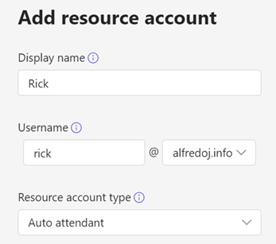
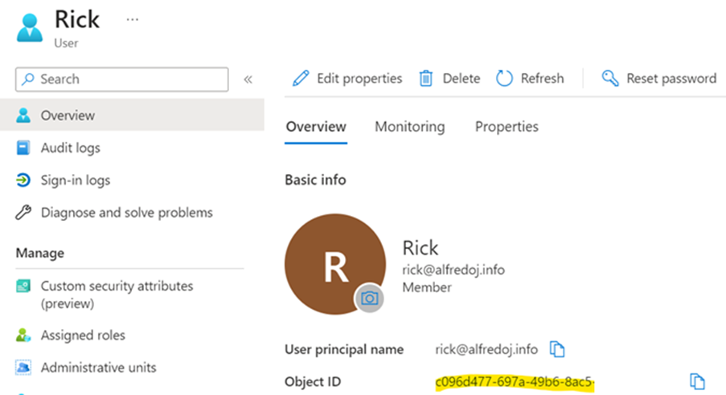
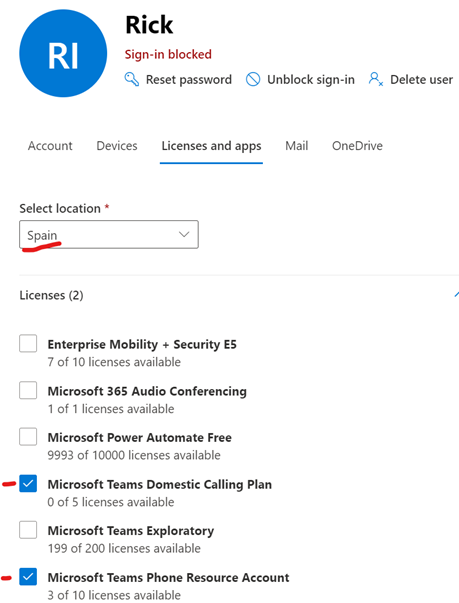
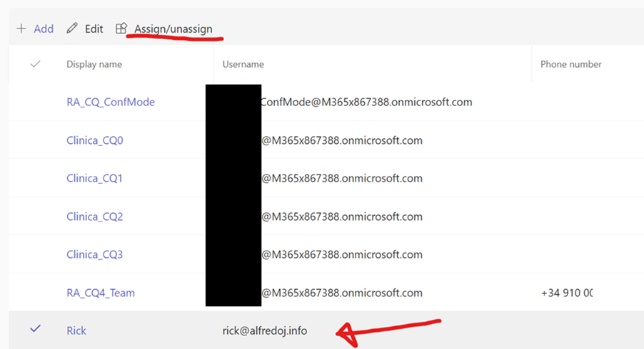
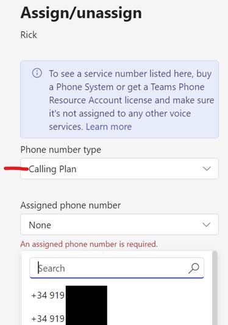
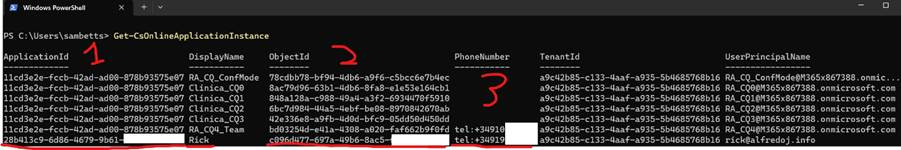

# Teams Calling Bots (with optional PSTN)
Stateless MS Graph calling bots built for ASP.Net 7. 

This is a project to demonstrate how calling bots can work in Teams, using service-hosted media (static WAV files only). It _doesn’t_ use the [Graph Communications Calling SDK](https://microsoftgraph.github.io/microsoft-graph-comms-samples/docs/client/index.html) except for some model classes and request validation checks, as I wanted a more .Net standardised app model: abstracted state persistence, standard logging libraries etc, that fit much better into things like functions apps where you don’t necessarily keep everything in memory. 

The calling logic therefore is much simplified and just uses standard .Net 7 classes and libraries, which makes it more lightweight, but does means it can’t handle app-hosted media for now. 

For PSTN bots especially we just want some basic logic-flow controls:

* Call answered.
* Play pre-recorded media.
* Record responses.

That way we can build nice clean bots on a minimalist framework (see below). 

## Example Projects
There are a few projects that use the same engine. 
* [P2P calling for PSTN calls - x2 examples.](src/examples/P2P/P2pPstnBot/README.md)
  * Web API implementation.
  * Azure Functions implementation - uses Azure Storage Tables to persist call state. 
* Group calling examples 2x:
  * [Group calling chatbot for PSTN and Teams users.](src/examples/Group/ChatBotWithCalling/README.md)
  * [Group calling functions app for PSTN and Teams users.](src/examples/Group/GroupCallingBotFunctionsApp/README.md)
* Misc: [PSTN "calling test bot"](src/examples/P2P/CallingTestBot/README.md) - useful for proactively testing if PSTN and Teams infrastructure is working.
## How do Bots Work in this Framework?
Here's an example:

```C#
public class SurveyCallingBot : BaseStatelessGraphCallingBot
{
    protected SurveyCallingBot(BotOptions botOptions, ICallStateManager callStateManager, ILogger logger) : base(botOptions, callStateManager, logger)
    {
        this.MediaMap[NotificationPromptName] = new MediaPrompt
        {
            MediaInfo = new MediaInfo
            {
                Uri = new Uri(botOptions.BotBaseUrl + "/audio/corpsurvey.wav").ToString(),
                ResourceId = Guid.NewGuid().ToString(),
            },
        };
    }

    protected override async Task CallConnectedWithAudio(ActiveCallState callState)
    {
        await base.SubscribeToToneAsync(callState.CallId);
        await base.PlayPromptAsync(callState.CallId, MediaMap.Select(m => m.Value));
    }

    protected override Task NewTonePressed(ActiveCallState callState, Tone tone)
    {
        _logger.LogInformation($"New tone pressed: {tone}");
        return Task.CompletedTask;
    }
}
```
Also a bonus: as the bots run "stateless", they can scale much easier, in Azure Functions apps for example. There is one such example bot in this repo...


All the examples need this setup being done.

## Setup Bot in Teams
The official documentation is here: https://learn.microsoft.com/en-us/graph/cloud-communications-phone-number#prerequisite-register-a-bot 

I had problems with it so resorted to my own setup methodology, but “your mileage may vary”. 

Note, that for all these steps you can do them all in PowerShell if you wish. I’m not a sysadmin so this is what works best for me. 

1. Go to: https://dev.teams.microsoft.com/ and create a new app.
2. In app features, add a new bot. You can reuse a previously created bot or create a new one.
3. Find the client-id in Azure portal.
4. Create or get a previous client secret for the bot app registration.
5. Every bot has an application registration in Azure AD, for which we’ll need to assign permissions.

Permissions needed (application):

* Calls.AccessMedia.All
* Calls.Initiate.All
* Calls.JoinGroupCall.All
* Calls.JoinGroupCallAsGuest.All

All these permissions need administrator consent to be effective. The group-call bot has extra requirements. 
That should be enough to make calls to Teams users (P2P – more permissions are needed if calling a group).

## Recording Bot Messages
In the examples given, there are a couple of example messages. Assuming you want your own, it needs to be [a specific format](https://learn.microsoft.com/en-us/graph/api/resources/mediainfo?view=graph-rest-1.0). From the docs:
* Currently supports only Wave file (.wav) format, single-channel, 16-bit samples with a 16,000 (16 KHz) sampling rate.

## Optional: Setup PSTN Calling
If you need PSTN calling, here are the extra steps. 

You need:
1. A tenant with Teams + Teams Phone.
2. Phone numbers available to assign. 
3. Available Teams licenses: Microsoft Teams Domestic Calling Plan, Microsoft Teams Phone Resource Account.
4. A resource account in Teams.

### Create Resource Account
Got Teams admin centre: https://admin.teams.microsoft.com/company-wide-settings/resource-accounts

Create an account. This will be the user object from which calls will be made, so it needs a UPN & display name. 



For now, the type we’ll set as “auto attendant” but we’ll change later.
Find the user in Azure AD and copy the object ID.



Now we need to link this account back to our bot. 

### Assign Resource Account Licenses and Ensure Region
In O365 administration, find the user and make sure the region of the user is set to the same as your target phone-number, and it has the right licenses assigned. 



### Assign Resource Account Phone Number
Back in Teams admin, find your resource account and select the row (not the display name). Click “Assign/unassign” in the toolbar. 


From here you can search for your phone number. 



*Note:* it can take a while for the admin centre to see license changes, especially for new users. It’s best to do this in PowerShell really, but if like me you’d prefer to use the UI where possible, it means you’ll have to wait.

### Link Resource Account to Bot
Finally we need PowerShell to link this resource account to the bot application. 

```PowerShell
Connect-MicrosoftTeams
Sync-CsOnlineApplicationInstance -ObjectId c096d477-697a-49b6-8ac5-xxxxxxx -ApplicationId d2a35726-10be-4092-8ea0-xxxxxxxxxx
```

The “application ID” is the client ID of your bot app registration. 

### Important: Verify Phone Account Link 
Check these three details. Run this PowerShell:

```PowerShell
Get-CsOnlineApplicationInstance
```

1. Application ID matches your bot app registration client ID.
2. Object ID matches your resources user account.
4. There is a phone-number assigned.



Unless all 3 details are correct, the calls won’t work.

## Publishing the Bot/Developer Tests
You can either publish this to a public site with an SSL endpoint, or just NGrok or some reverse-proxy tool to run from your local machine. In either case the bot will need a base URL configuration.

**Important**: for NGrok, you'll need an account even if it's a free one. https://ngrok.com/
