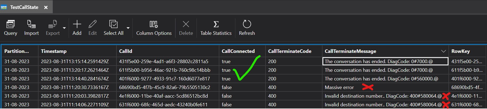
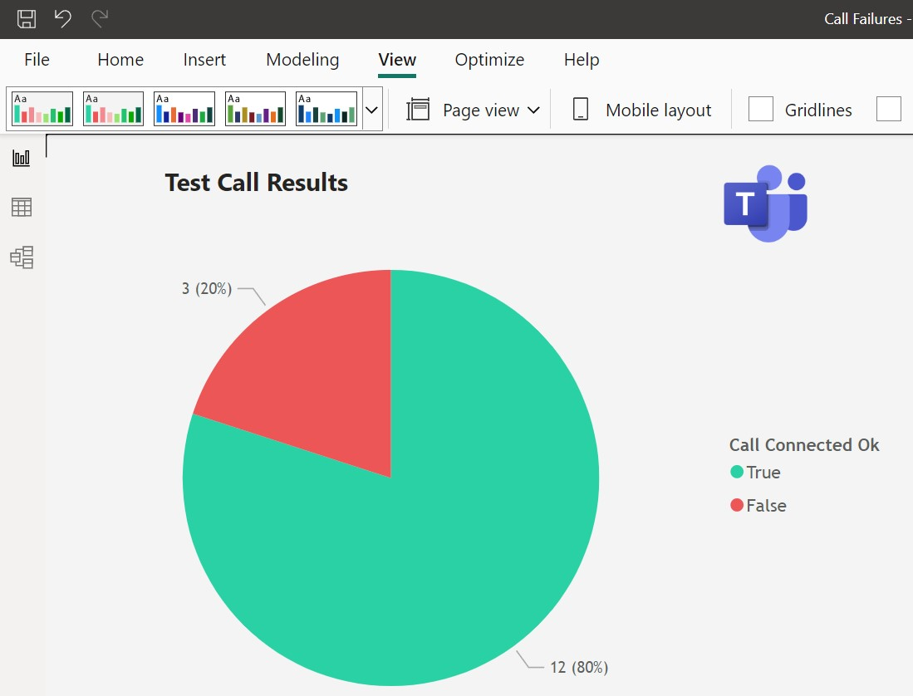
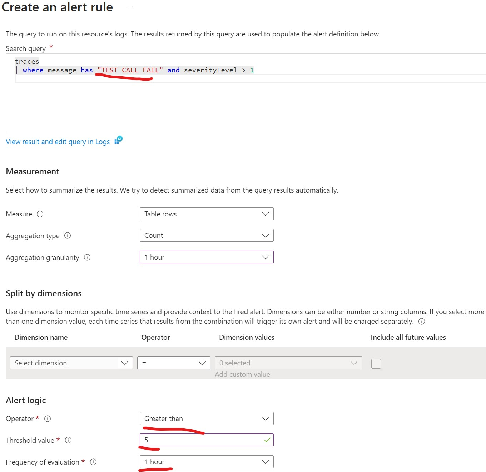
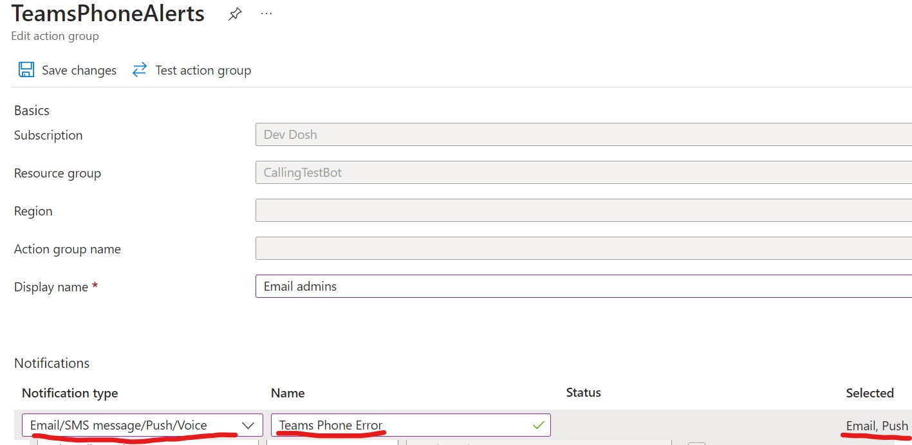

# Teams Calling Test Bot
This bot monitors your Teams Phones infrastructure automatically. It makes periodic tests to a PSTN number and reports the results to an Azure storage table.

Use this project to proactively test your Teams Phone infrastructure and alert on errors sooner. 

## Setup Steps
1. Setup a calling bot. Instructions [here](https://github.com/sambetts/graph-calling-bots#setup-bot-in-teams).
2. Create a Functions App with Azure Storage account in an Azure subscription. Function apps require a storage account, so you could just use that one.
3. Deploy the bot to an Azure Functions app. Configure below settings.
4. Recommended: Enable Application Insights for the Azure Functions app and setup alerts for failed calls.
5. Optional: Query results from the Azure storage table (using Power BI for example).

The bot will make scheduled calls every configurable period, or you can trigger a test call with a HTTP call. 

## Functions App Configuration
Name | Description
--------------- | -----------
MicrosoftAppId | ID of bot Azure AD application
AppInstanceObjectId | For PSTN calls only: object ID of the user account used for calling
AppInstanceObjectIdName | For PSTN calls only: object ID of the user account used for calling
TenantId | Tenant ID of Azure AD application
MicrosoftAppPassword | Bot app secret
BotBaseUrl | URL root of the bot. Example: https://callingbot.eu.ngrok.io
Storage | Azure storage account connection string. Example: UseDevelopmentStorage=true
TestNumber | The number to call to run tests with

## Reporting on Data
You can connect Power BI to the Azure storage table and show nice graphics.

As there is the timestamp in there, you can also do show analysis over time if you have more Power BI skills than me :)

## Setup Outage Alerts
Once deployed we can create alerts for if enough calls fail to connect so we can respond to a possible outage ASAP. 

Create a new alert in App Insights

Configure action when too many errors are detected.

## Read Results via API
You can also read the results programmatically via the [Azure Tables REST APIs](https://learn.microsoft.com/en-us/rest/api/storageservices/query-entities)
