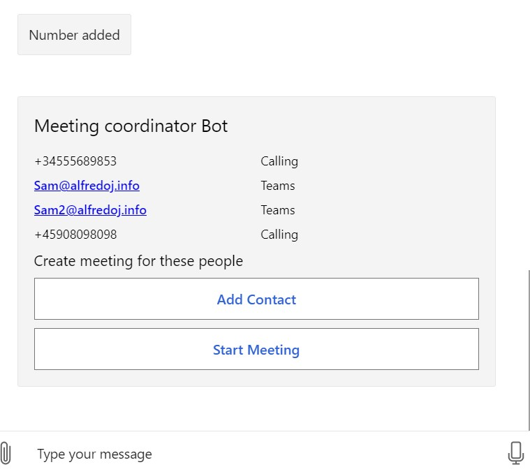
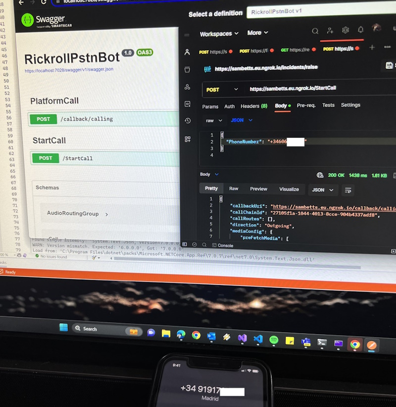

# Group Calling Bot
This bot is in fact two bots in one; a chatbot with Bot Framework SDK 4 and a calling bot for Graph calls, using the ServiceHostedMediaCallingBot engine the other bots in this repo use.



As it uses Bot Framework etc, it can be connected easily to Teams once running. The chatbot funcionality is purely to configure a meeting to hand-off to "GroupCallingBot":

```C#
public class GroupCallingBot : PstnCallingBot<GroupCallActiveCallState>
{
    public GroupCallingBot(RemoteMediaCallingBotConfiguration botOptions, ICallStateManager<GroupCallActiveCallState> callStateManager, ILogger<GroupCallingBot> logger)
        : base(botOptions, callStateManager, logger)
    {
        // Generate media prompts. Used later in call & need to have consistent IDs.
        MediaMap["Rick"] = new MediaPrompt
        {
            MediaInfo = new MediaInfo
            {
                Uri = new Uri(botOptions.BotBaseUrl + "/audio/rickroll.wav").ToString(),
                ResourceId = Guid.NewGuid().ToString(),
            },
        };
    }

    /// <summary>
    /// Start group call with required attendees.
    /// </summary>
    public async Task<Call> StartGroupCall(MeetingRequest meetingRequest)
    {
        // Attach media list
        var mediaToPrefetch = new List<MediaInfo>();
        foreach (var m in MediaMap) mediaToPrefetch.Add(m.Value.MediaInfo);
        
        // Create call for initial participants
        var newCall = new Call
        {
            MediaConfig = new ServiceHostedMediaConfig { PreFetchMedia = mediaToPrefetch },
            RequestedModalities = new List<Modality> { Modality.Audio },
            TenantId = _botConfig.TenantId,
            CallbackUri = _botConfig.CallingEndpoint,
            Direction = CallDirection.Outgoing,
            Source = new ParticipantInfo
            {
                Identity = new IdentitySet
                {
                    Application = new Identity { Id = _botConfig.AppId },
                },
            }
        };

        // Work out who to call first & who to invite
        var (initialAddList, inviteNumberList) = meetingRequest.GetInitialParticipantsAndInvites(_botConfig.TenantId);
        newCall.Targets = initialAddList;

        // Set source as this bot
        newCall.Source.Identity.SetApplicationInstance(
            new Identity { Id = _botConfig.AppInstanceObjectId, DisplayName = _botConfig.AppInstanceObjectName });

        // Start call
        var createdCall = await StartNewCall(newCall);

        // Wait 2 seconds for call to be created and notification to be recieved (so we have a call state to update)
        await Task.Delay(2000);

        // Get state and save invite list for when call is established
        var createdCallState = await _callStateManager.GetByNotificationResourceUrl($"/communications/calls/{createdCall.Id}");
        if (createdCallState != null)
        {
            createdCallState.Invites = inviteNumberList;
        }

        return createdCall;
    }

    protected async override Task CallEstablished(GroupCallActiveCallState callState)
    {
        // Invite everyone else
        foreach (var invite in callState.Invites)
        {
            await InvitePstnNumberToCallAsync(callState.CallId, invite);
        }
    }
}
```

For group calls that mix PSTN and Teams users, it's impossible to create a call for everyone simulatenously. Because of this we create a call for all Teams users & then invite everyone else once the call is established. 

## Debugging Solution
The easiest way to run is via the Bot Framework Emulator - https://github.com/microsoft/BotFramework-Emulator

* Add solution configuration via Visual Studio secrets - https://learn.microsoft.com/en-us/aspnet/core/security/app-secrets?view=aspnetcore-7.0&tabs=windows#manage-user-secrets-with-visual-studio
* Run NGrok to expose solution to public endpoint.

```
ngrok http http://localhost:3978 --host-header="localhost:3978"
```
* Update 'BotBaseUrl' if needed with NGrok URL.
* Run bot, and open in Bot Framework Emulator - configure bot with same application ID & password as configured for bot.

## Configuration
These configuration settings are needed:

Name | Description
--------------- | -----------
MicrosoftAppId | ID of bot Azure AD application
AppInstanceObjectId | For PSTN calls only: object ID of the user account used for calling
AppInstanceObjectIdName | For PSTN calls only: object ID of the user account used for calling
TenantId | Tenant ID of Azure AD application
MicrosoftAppPassword | Bot app secret
BotBaseUrl | URL root of the bot. Example: https://callingbot.eu.ngrok.io

## Setup Bot
This bot uses the setup procedure in the [root readme](../../../../README.md). 

Additional permissions needed (application) for this example:

* User.Read.All

The result:


Rick calling!
